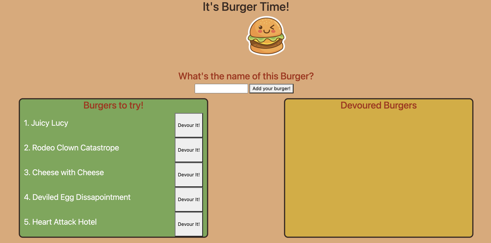

# burger-time

## About

This full stack application allows the user to enter the name of a burger, which will then be displayed on the left, with the option to devour the burger, moving it to the right

## Table of Contents

- [Files](#Files)
- [Usage](#Usage)
- [Contributions](#Contributions)
- [Testing](#Testing)
- [Credits](#Credits)
- [License](#License)
- [Contact](#Contact)

## Files

- (config)
  - connection.js
  - orm.js
- controllers
  - burgers_controller.js
- db
  - schema.sql
  - seeds.sql
- models
  - burger.js
- package.json
- public
  - assets
    - css
      - burger_style.css
    - img
      - cute-burger.png
- server.js
- views
  - index.handlebars
  - layouts
    - main.handlebars

## Usage

Deployed project can be found at [burger-time](https://rocky-cliffs-37100.herokuapp.com/)

Simply add the name of a burger you'd like to eat, and then devour it!

## Contributions

Contributions can be made by forking the repository on gitHub and submitting a pull request.

The repository can be found at [burger-time](https://github.com/jacob-af/burger-time)

## Testing

No testing suites were used in this project.

## Credits

This project was developed by Jacob A. Feitler

## License:

This project is licensed under the MIT license, copyright 2021

## Contact

You can view my GitHub profile at [github.com/jacob-af](https://github.com/jacob-af)
